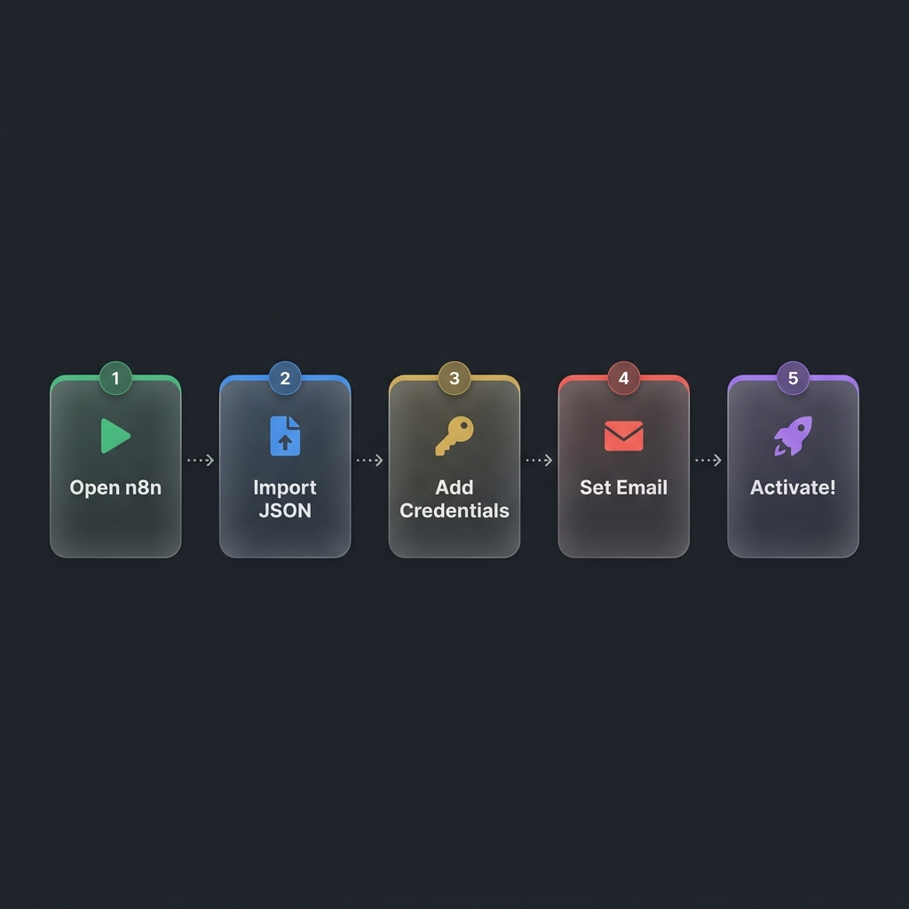
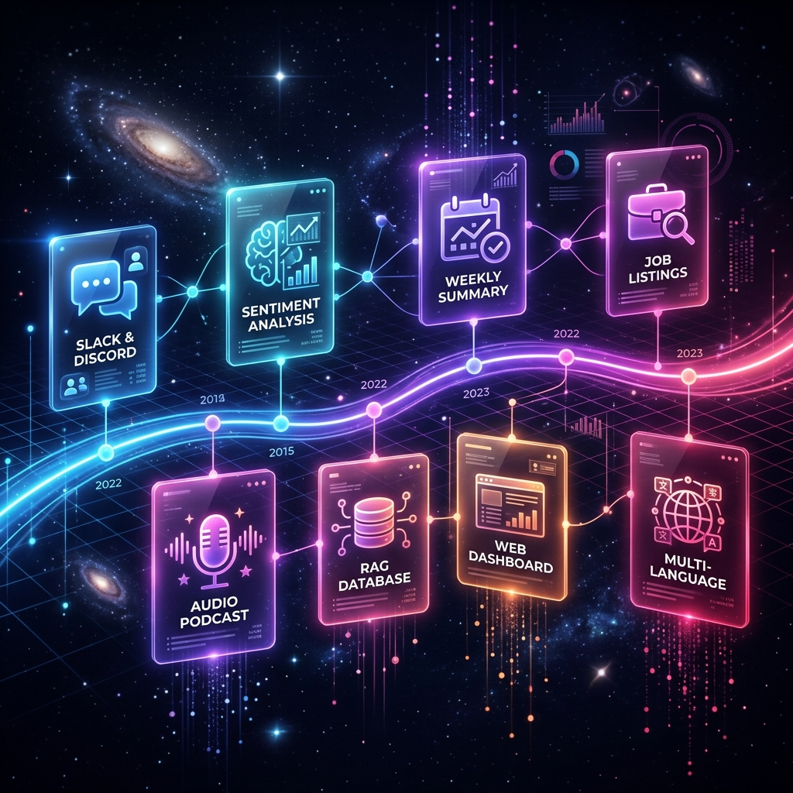

# 🤖 Daily GenAI & Agentic AI Career Briefing

> An automated **n8n** pipeline that wakes up every morning, scrapes the latest GenAI & Agentic AI news from two live sources, deduplicates them using stateful memory, lets **Google Gemini** extract a structured JSON briefing, and delivers a beautiful HTML email digest directly to your Gmail inbox — **zero clicks required**.

<div align="center">


</div>

---

## ⚡ How It Works

<div align="center">


*↑ End-to-end 6-step automation pipeline — pencil sketch overview*

</div>

The workflow runs automatically every day via a **cron schedule**. Here's what happens under the hood:

| Step | Node | What It Does |
|:----:|:-----|:-------------|
| **1** | `Daily Trigger (Cron)` | Fires at **8:00 AM** daily. Two parallel triggers kick off the Google News and Hacker News branches simultaneously. |
| **2** | `Fetch Google News RSS` | Hits Google News RSS with a targeted query: `"agentic AI" OR "generative AI" OR "AI agent" OR "AI tool" OR "AI regulation"` |
| **2** | `Fetch Hacker News` | Calls the **Hacker News Algolia API** (`search_by_date?query=AI agent`) to pull the 20 most recent stories. |
| **3** | `Combine → Dedupe & Filter` | Merges both feeds. A custom JavaScript node checks **workflow static data** to skip already-seen URLs, filters to the last 24 hours, sorts by recency, and keeps the **top 15 freshest** articles. |
| **4** | `Has New Items?` | A gatekeeping filter node. If `count == 0`, the workflow **stops immediately** — no blank emails sent. |
| **5** | `Build Career Briefing (Gemini)` | Feeds the 15 headlines into **`gemini-3.1-flash-lite`** with a strict structured JSON prompt. Extracts: Market Sentiment, Top News + Impact, Models & Tools, Skills to Learn, Industry Impact. |
| **6** | `Format HTML Email` | A JavaScript Code Node parses the JSON and compiles a clean, fully-styled HTML email template. |
| **7** | `Send Email Digest` | Dispatches the HTML email via **Gmail OAuth SMTP** to your inbox. |

---

## 🧠 AI Engineering Highlights

This project demonstrates production-grade AI engineering patterns beyond simple prompting:

### ✅ Structured LLM Outputs (JSON Schema Enforcement)
Instead of relying on fragile free-text generation, Gemini is constrained via a **strict JSON schema prompt**. The output schema is enforced at the prompt level:
```json
{
  "sentiment":       { "score": "Bullish | Bearish | Neutral", "reason": "..." },
  "top_news":        [{ "headline": "...", "impact": "..." }],
  "models_tools":    ["tool1", "tool2"],
  "skills":          [{ "skill": "...", "reason": "..." }],
  "industry_impact": "..."
}
```
A downstream JavaScript node strips any leaked markdown fences and `JSON.parse()`s safely.

### ✅ Stateful Deduplication via Workflow Memory
The deduplication node uses **`$getWorkflowStaticData('global')`** — n8n's built-in stateful storage — to maintain a rolling list of up to 500 sent article URLs across runs. This means you **never receive the same article twice**, even across multiple days.

### ✅ Separation of Concerns
AI processing is strictly separated from presentation logic:
- 🤖 **LLM** → handles only data extraction
- 🖥️ **JS Code Node** → handles all HTML templating

### ✅ Gatekeeping Filter (No Blank Emails)
Before invoking Gemini, the workflow checks `count > 0`. If there are no fresh articles (e.g., a weekend with low news volume), execution stops and **no API calls are made**.

### ✅ Market Sentiment Analysis
The AI is used as an **analytical engine** to grade the overall tone of today's AI news as `Bullish`, `Bearish`, or `Neutral`, with a one-sentence rationale.

---

## 🏗️ System Architecture

<div align="center">


*↑ Node routing, parallel fetch branches, decision gatekeeping, and AI synthesis — pencil sketch*

</div>

### Node Map

```
[Daily Trigger - News] ──→ [Fetch Google News RSS] ──┐
                                                       ├──→ [Combine News Sources]
[Daily Trigger - HN]   ──→ [Fetch Hacker News]  ──→  │
                              [Split HN Hits]   ──────┘
                                                       ↓
                                          [Dedupe, Filter & Build Digest]
                                                       ↓
                                            [Has New Items? (Filter)]
                                                       ↓ YES
                                          [Build Career Briefing]  ←── [Gemini Model]
                                                       ↓
                                          [Format HTML Email (JS)]
                                                       ↓
                                           [Send Email Digest (Gmail)]
```

---

## 📧 What the Email Looks Like

The delivered HTML email contains 5 structured sections:

| Section | Content |
|:--------|:--------|
| **Market Sentiment** | `Bullish / Bearish / Neutral` + one-line rationale |
| **🔥 Top News Today** | Up to 5 headlines with `impact` summary per article |
| **🤖 New Models & Tools** | Extracted tool names mentioned in today's news |
| **🛠️ Skills to Improve** | Recommended skills with context on why they're trending |
| **💼 Industry Impact** | 2-3 sentence analysis of what this means for engineering roles |

---

## ⚡ Quick Start & Import

<div align="center">



*↑ 4-step setup — up and running in under 5 minutes*

</div>

### Step 1: Get n8n Running

**Option A — Docker (Recommended)**
```bash
# Copy environment template
cp .env.example .env
# Fill in your values in .env, then:
docker compose up -d
# Open: http://localhost:5678
```

**Option B — n8n Cloud**
Sign up at [n8n.io](https://n8n.io) and use the cloud editor directly.

---

### Step 2: Import the Workflow
1. Download [`genai-daily-career-briefing.json`](genai-daily-career-briefing.json)
2. In n8n, click **`+`** (top-left) → **Import from File**
3. Upload the `.json` file

---

### Step 3: Set Credentials

You need to configure **2 credentials** inside n8n:

**Gemini API Key**
- Go to [Google AI Studio](https://aistudio.google.com/apikey) → Create API Key
- In n8n: open the **`Gemini Model`** node → paste your key

**Gmail OAuth**
- Set up a Google Cloud project and OAuth 2.0 credentials
- Guide: [n8n Google OAuth docs](https://docs.n8n.io/integrations/builtin/credentials/google/oauth-single-service/)
- In n8n: open **`Send Email Digest`** node → connect your Gmail account

---

### Step 4: Set Your Recipient Email
- Open the **`Send Email Digest`** node
- Change `YOUR_EMAIL@gmail.com` in the `sendTo` field to **your actual email**

---

### Step 5: Activate!
- Toggle the workflow to **Active** (top-right switch)
- *(Optional)* Click **Execute Workflow** to trigger an immediate test run

---

## 🔐 Configuration & Security

```bash
# 1. Copy the template
cp .env.example .env

# 2. Fill in your values
GEMINI_API_KEY=your_gemini_api_key_here
RECIPIENT_EMAIL=your_email@gmail.com
GMAIL_CLIENT_ID=your_google_client_id_here
GMAIL_CLIENT_SECRET=your_google_client_secret_here
```

> ⚠️ The `.env` file is excluded from Git via `.gitignore`. **Never commit real credentials.**

---

## 📁 Repository Structure

```text
genai-n8n/
├── genai-daily-career-briefing.json   # ← Complete n8n workflow (import this)
├── docker-compose.yml                 # Self-hosted n8n via Docker
├── .env.example                       # Environment variable template
├── .gitignore                         # Ignores .env and sensitive files
├── README.md                          # This file
└── assets/
    ├── how_it_works_sketch.png        # Pipeline overview (pencil sketch)
    ├── architecture_sketch.png        # System architecture (pencil sketch)
    ├── setup_steps.png                # Quick start visual (pencil sketch)
    ├── future_roadmap.png             # Roadmap diagram (pencil sketch)
    ├── email_preview.png              # Sample email output screenshot
    └── hero_banner.png                # Project banner image
```

---

## 🏷️ Project Tags

<div align="center">

| Area | Tags |
| :--- | :--- |
| **Automation** |    |
| **Artificial Intelligence** |     |
| **Integrations** |     |
| **Career & Learning** |    |
| **Dev Style** |    |

</div>

---

## 🚀 Future Improvements

<div align="center">



*↑ Planned evolution from single-agent pipeline to full multi-agent system — pencil sketch*

</div>

### Phase 1 — Core Extensions

| Improvement | Description |
|:------------|:------------|
| **🗄️ Vector Database (RAG)** | Connect to **Pinecone** or **Qdrant** to store historical article embeddings. The LLM can then reference past context to detect long-term industry trends and avoid repeating insights from previous briefings. |
| **🕷️ Full Article Scraping** | Replace RSS summary text with a **Puppeteer / HTTP Request node** that fetches the full article body before passing it to Gemini — enabling much deeper, nuanced analysis instead of headline-only summaries. |
| **📰 More News Sources** | Add **Dev.to**, **Towards Data Science**, **ArXiv AI abstracts**, or **LinkedIn Pulse** as additional RSS/API sources to broaden coverage. |

### Phase 2 — Multi-Agent Architecture

| Improvement | Description |
|:------------|:------------|
| **🔍 Researcher Agent** | Use n8n's **LangChain agent nodes** to deploy a dedicated Researcher Agent that autonomously decides which sources to query, ranks articles by relevance, and summarizes findings for the Writer. |
| **✍️ Writer Agent** | A separate Writer Agent receives the ranked research and drafts a personalized briefing with a consistent editorial voice — using memory of your past preferences. |
| **✅ Editor / Fact-Check Agent** | A final verification agent that cross-references claims in the briefing against a trusted knowledge base before the email is dispatched. |

### Phase 3 — Multi-Channel Delivery

| Improvement | Description |
|:------------|:------------|
| **💬 Slack / Discord Bot** | Add a Webhook output node to push the briefing as a formatted message to your team's **Slack** or **Discord** channel every morning. |
| **🎙️ Audio Podcast Digest** | Pipe the briefing text through a **Text-to-Speech node** (ElevenLabs or Google TTS) to generate a short audio podcast you can listen to on your commute. |
| **📊 Web Dashboard** | Build a lightweight **Next.js** frontend that reads briefing history from a database and visualizes sentiment trends, trending tools, and skill frequency over time. |
| **🌍 Multi-Language Support** | Add a translation step after the AI parser to deliver the briefing in the user's preferred language using Gemini's translation capabilities. |
| **📅 Weekly Summary** | Add a separate Saturday workflow that aggregates the week's 5 briefings into a single executive summary email with trend highlights. |

---

## 🤝 Contributing

1. Fork the repository
2. Create a feature branch: `git checkout -b feature/my-improvement`
3. Commit your changes: `git commit -m "feat: add Slack delivery channel"`
4. Push and open a Pull Request

Feedback and workflow forks are welcome! If you add a new source or delivery channel, please share the `.json` workflow export.

---

<div align="center">
I WILL BUILT WITH PASSION WITH INTREST IN AI.

</div>
