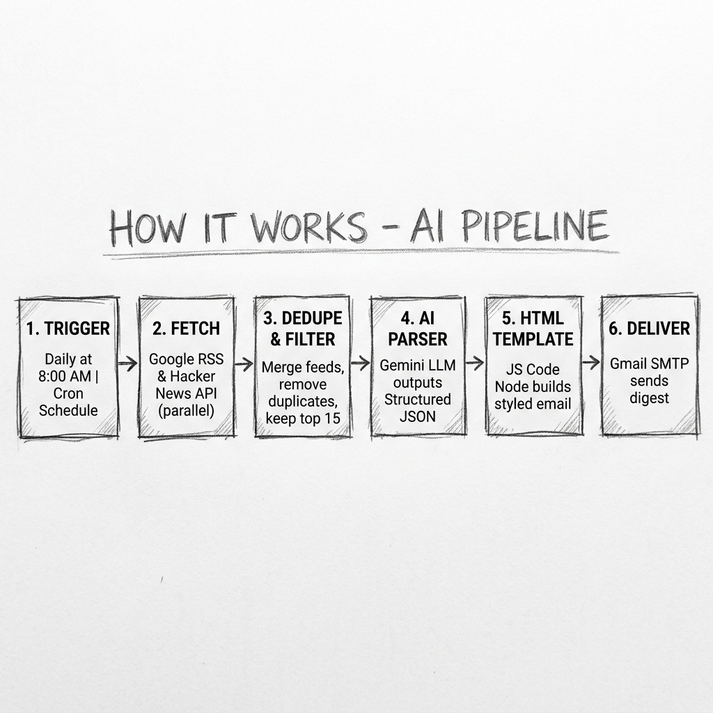
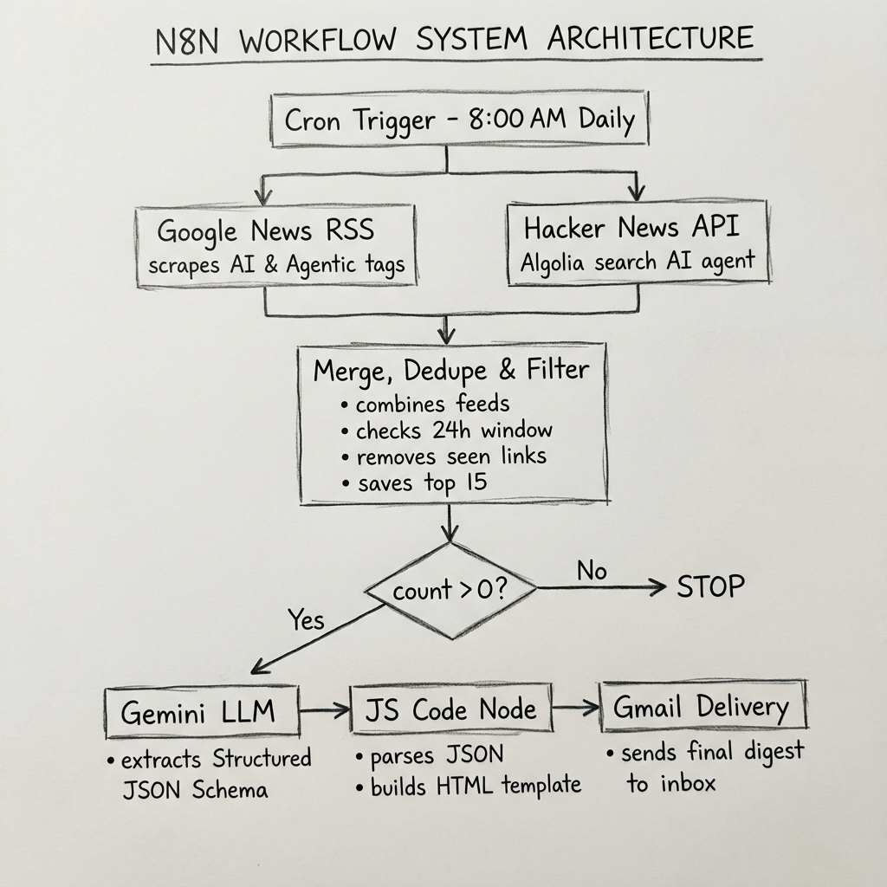

# 🤖 Daily GenAI & Agentic AI Career Briefing

An automated news aggregation and synthesis pipeline built in **n8n** that collects, filters, and summarizes the latest Generative AI and Agentic AI news every morning, delivering a structured career briefing directly to your email inbox.

---

## ⚡ How It Works

<div align="center">



*↑ End-to-end 5-step automation pipeline*

</div>

The pipeline runs automatically every day using the following sequential steps:

1. **Trigger**: The automation starts at **8:00 AM** daily.
2. **Collect**: Feeds from **Google News RSS** and **Hacker News API** are crawled in parallel.
3. **Filter**: The stories are merged, deduplicated via stateful storage, and filtered for the top 15 freshest stories.
4. **AI Parser**: Google Gemini (`gemini-3.1-flash-lite`) analyzes the headlines and extracts a **Structured JSON Schema** containing Market Sentiment, Top News, Tools, and Skills.
5. **Template**: A custom JavaScript Code Node parses the JSON and compiles it into a beautifully styled HTML template.
6. **Deliver**: The final HTML digest is dispatched securely to your Gmail inbox.

---

## 🧠 AI Engineering Highlights

This project was designed to demonstrate production-grade AI engineering patterns beyond simple prompting:

*   **Structured LLM Outputs (JSON)**: Instead of relying on fragile free-text generation, the Gemini LLM is constrained to output a strict JSON schema containing arrays and nested objects. This ensures reliable data extraction.
*   **Separation of Concerns**: AI processing is strictly separated from presentation logic. The LLM only handles data extraction, while a downstream JavaScript Node handles the HTML UI templating.
*   **Market Sentiment Analysis**: The workflow doesn't just summarize; it uses the LLM as an analytical engine to grade the overall tone of the industry (e.g., Bullish or Bearish) based on the latest headlines.

---

## 🏗️ System Architecture

<div align="center">



*↑ Logical node routing, decision branching, and filters*

</div>

### Technical Highlights

*   **Stateful Deduplication**: A custom JavaScript block interacts with n8n workflow static metadata to track historically processed links, ensuring you never receive duplicate articles across days.
*   **Gatekeeping Filter**: Prior to generating the briefing, the workflow counts the number of fresh articles. If no new posts are available, the execution stops, preventing blank emails.
*   **Gemini AI Engine**: Utilizes `gemini-3.1-flash-lite` to draft the HTML-formatted sections, maintaining high execution speed while minimizing API resource usage.
*   **Gmail SMTP Integration**: Integrates directly with Google's OAuth protocol to securely authenticate and dispatch emails.

---

## ⚡ Quick Start & Import

You can launch this exact workflow in your own n8n instance in a few simple steps.

### Step 1: Import Workflow File
*   Download [genai-daily-career-briefing.json](genai-daily-career-briefing.json).
*   Open n8n, click the **`+`** icon on the top-left, select **Import from File**, and upload the `.json` file.

### Step 2: Set Credentials
Locate the setup nodes inside n8n to connect your accounts:
*   **Gemini Model**: Paste your Gemini API key from [Google AI Studio](https://aistudio.google.com/apikey).
*   **Send Email Digest**: Sign in using Google OAuth credentials for your Gmail mailbox.

### Step 3: Configure Recipient
*   Open the **Send Email Digest** node settings.
*   Change the target email in the `sendTo` field from `YOUR_EMAIL@gmail.com` to **your personal email address**.

### Step 4: Turn It On!
*   Toggle the switch in the top-right corner to **Active** to schedule the automated daily briefings.
*   *Optional:* Click **Execute Workflow** at the bottom of the canvas to run a test execution immediately.

---

## 🔐 Configuration & Security

Credentials and configuration parameters can be stored securely inside environment files to prevent accidental leakage:

1. Copy the setup file template:
   ```bash
   cp .env.example .env
   ```
2. Open `.env` and fill in your values:
   *   `GEMINI_API_KEY`: API access token.
   *   `RECIPIENT_EMAIL`: Briefing destination address.
   *   `GMAIL_CLIENT_ID` / `GMAIL_CLIENT_SECRET`: Google OAuth application credentials.

*Note: The `.env` file is excluded from Git tracking via `.gitignore` to keep credentials completely local.*

---

## 📁 Repository Structure

```text
genai-n8n/
├── assets/                          # Workflow diagrams
│   ├── how_it_works_sketch.png     # Pencil sketch - Workflow steps
│   └── architecture_sketch.png     # Whiteboard sketch - System architecture
├── genai-daily-career-briefing.json # Complete n8n workflow file
├── .env.example                     # Env variable template
├── .gitignore                       # Ignored file list
└── README.md                        # Documentation
```

---

## 🏷️ Project Tags

<br/>

<div align="center">

| Area | Tags |
| :--- | :--- |
| **Automation** |     |
| **Artificial Intelligence** |      |
| **Integrations** |     |
| **Career & Education** |    |
| **Development Style** |   |

</div>

<br/>


## ?? Future Roadmap

While this is a minor portfolio project demonstrating core AI integration concepts, there are several ways it can be expanded in the future:
*   **Vector Database Integration (RAG):** Connect to Pinecone or Qdrant to store historical articles, allowing the AI to reference past context and detect long-term industry trends.
*   **Web Scraping Node:** Instead of relying just on RSS summaries, implement a Puppeteer/HTTP node to scrape the full article text before feeding it to Gemini for deeper analysis.
*   **Multi-Agent Architecture:** Use advanced LangChain nodes to deploy a 'Researcher Agent' to fetch data and a 'Writer Agent' to draft the email, passing data between them.

